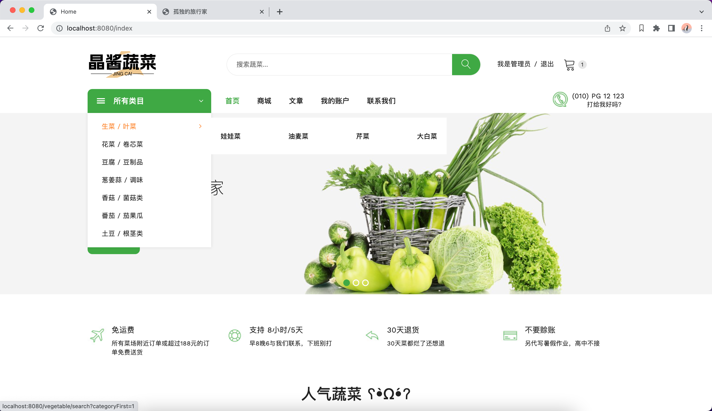
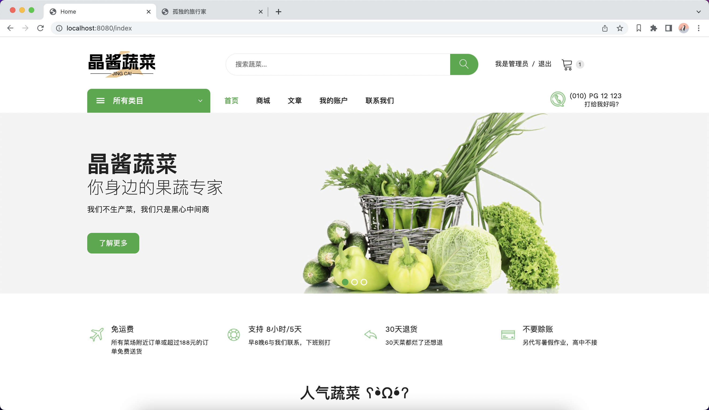
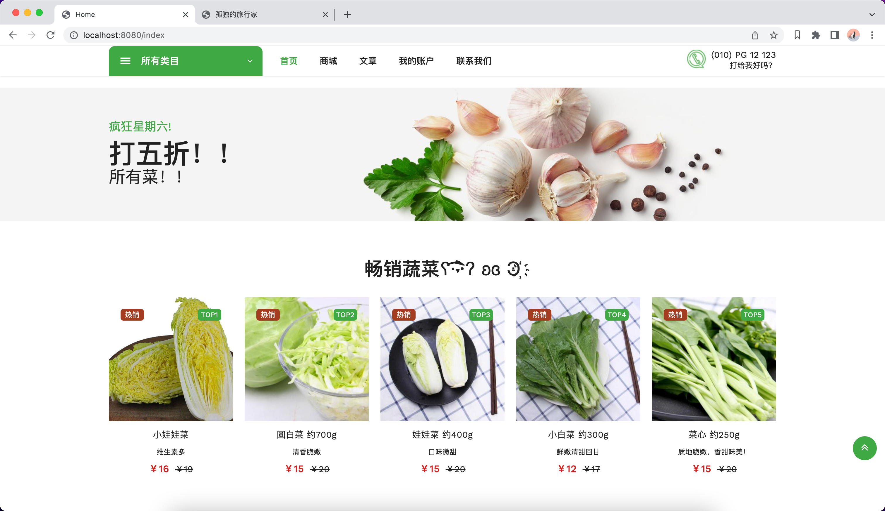
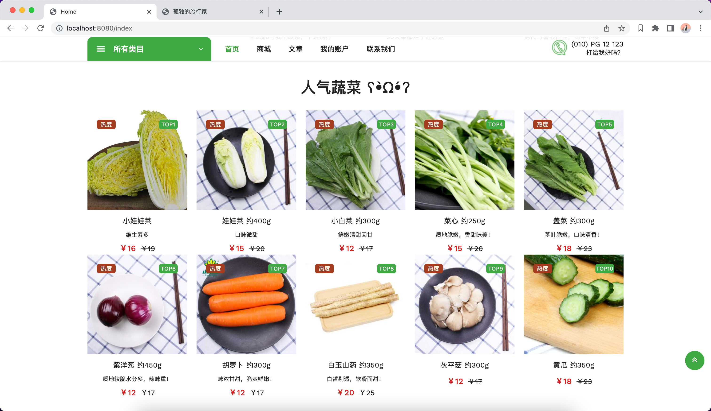
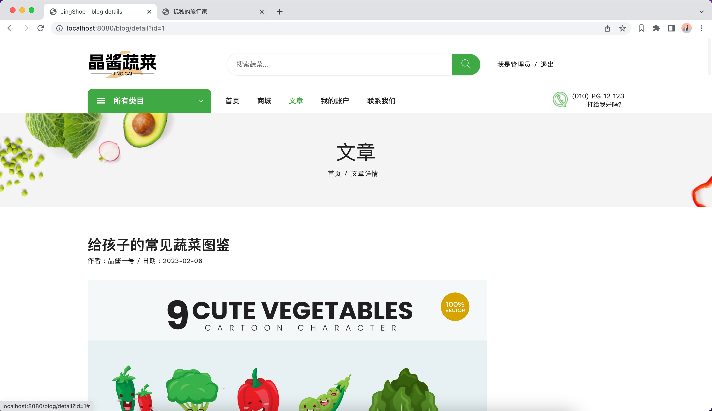
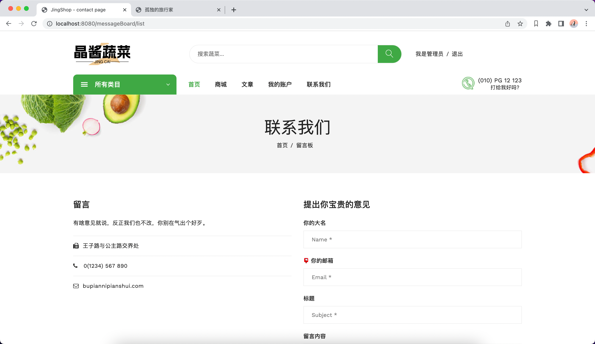
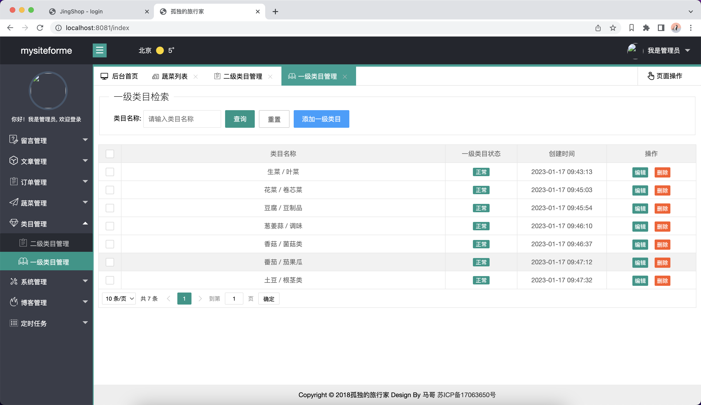
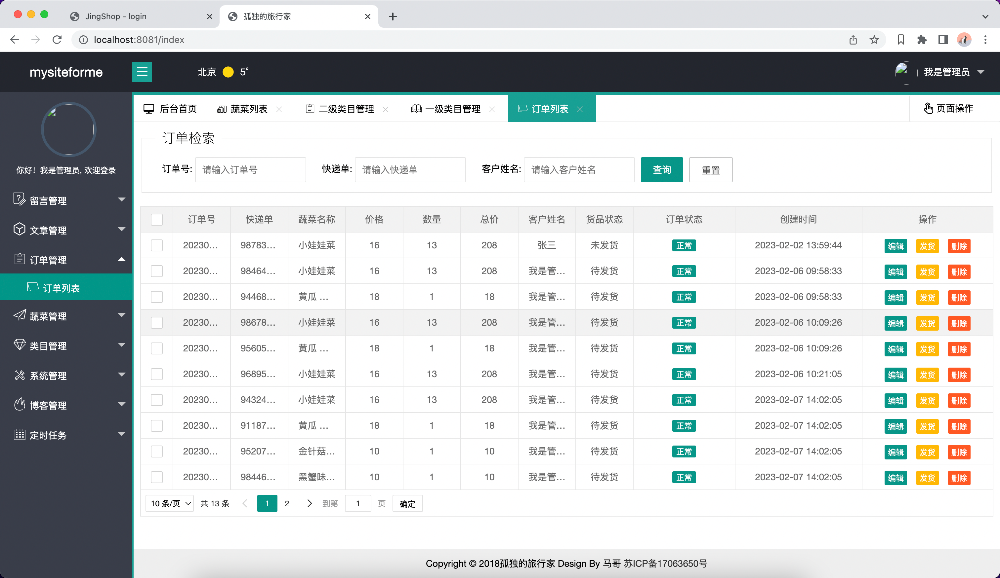
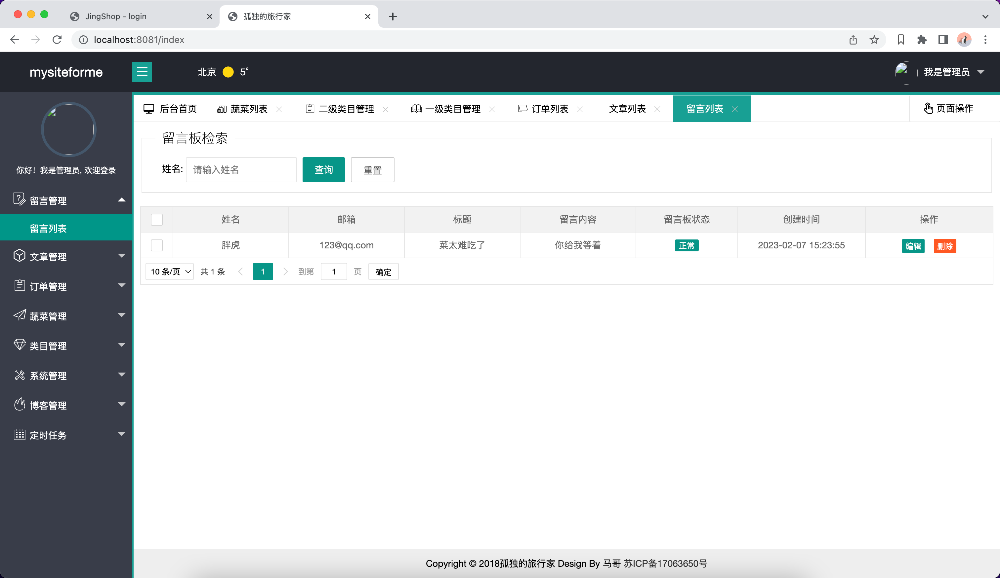

# 晶酱蔬菜商城

蔬菜商城是我自己利用业余时间编写的一个项目，用户在商场选购蔬菜下单。

# 演示地址
https://www.bilibili.com/video/BV1Mv4y147ir/?spm_id_from=333.999.0.0

#### 采用的技术

1. springboot
2. freemarker
3. mybatis-plus
4. mysql8

#### 模块
| 模块  | 备注           |
|-----|--------------|
| 首页  | 二级分类、热销蔬菜、文章 |
| 我的  | 订单、住址        |
| 文章  | 文章阅读         |
| 留言板 | 客户留言         |
| 商城  | 搜索页          |

#### 另外商城数据采用爬虫抓取清洗入库
数据采集比较麻烦我也是偷懒，pyhton抓取数据清洗到数据库
[Python抓蔬菜数据到数据库](https://www.toutiao.com/article/7195757474467676683/)

## 商城截图
#### 前端

#### 后台管理系统

[后台系统用到的开源项目](https://gitee.com/wanglingxiao/mysiteforme)
> 全自动生成代码，搬砖神器，从此把项目经理踩在脚下

天下没有免费的午餐，前后端代码+部署调试搞活动，详情加QQ咨询。
前10名购买半价，另外有一些学习问题也可以一起交流，买到就是赚到。

QQ：356563069

助理QQ：1942683185
